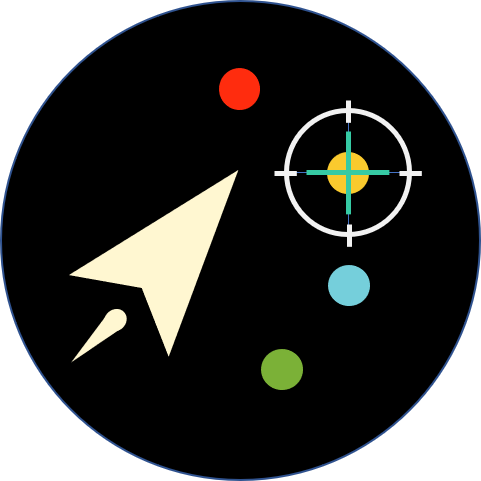

## ✨彩球大战
#### 一不小心，就被五颜六色的彩色球包围了！想尽办法消灭他们吧！

<div style="text-align: center">


</div>

[](https://github.com/TrevorHuang/red-hacker/blob/master/LICENSE)

<br/>

## 📦开发环境
* #### [Cocos](https://www.cocos.com/)

<br/>

## ⌨️项目结构

```
├─ assets 代码文件夹
│  ├─ scene 场景文件夹
│  │  ├─ Game 主要游戏场景
│  │  ├─ GameOver 游戏结束场景
│  │  └─ Login 游戏开始场景
│  ├─ scripts Game场景的组件文件夹
│  │  ├─ BonusManager 道具，拾起'Tools'生成'Bonus'技能
│  │  ├─ EnemyManager 敌人
│  │  ├─ Player 玩家
│  │  ├─ Rocker 摇杆
│  │  └─ Score 积分
│  └─ textures 资源文件夹
├─ settings Cocos项目设置文件夹
└─ Cocos杂项文件...
```